**Creador**: Ayoze Hernández Díaz

## Índice

+ [Como subir un repositorio local a la nube](#id0)
+ [Crear un script que automatice la creación del repo](#id1)

## Como subir un repositorio local a la nube. <a name="id0"></a>

Para empezar hay que ejecutar los siguientes comandos para configurar ***git*** 

```
sudo apt install git

git config --global user.name <tu-usuario-de-github>
git config --global user.email <tu-email-del-usuario-de-github>
```

Una vez realizado el paso anterior, ya tenemos ***git*** configurado, ahora para configurar ***gh*** ejecutamos el siguiente comando:

```
sudo apt install gh
```

Para configurar tu información en gh hay 2 maneras, aquí se va a mostrar 1 de ellas, que es haciendo la autenticación mediante navegador, pero nos podemos autenticar mediante la terminal en caso de tener un [token de github](https://github.com/settings/tokens)

El token necesita al menos los siguientes checkbox para funcionar:

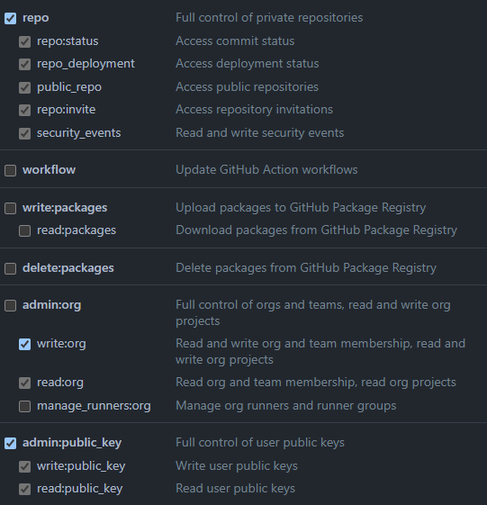

Una vez generado procedemos a usar el siguiente comando:

```
gh auth login
```

Al ejecutar el comando podemos interactuar con la terminal mediante el uso de las flechas del teclado, el texto que aparezca en azul (como en la primera imagen) es la selección actual. Seleccionamos Github.com

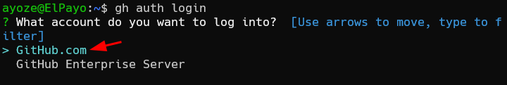

Como metodo para las operaciones en Github utilizaremos el protocolo ssh

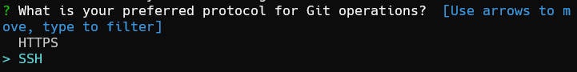

En el paso actual nos pedirá una clave pública, si no la tenemos creada, cancelaremos con Control + C y ejecutaremos el comando ***ssh-keygen*** y dejaremos todos los campos vacios para generar una clave, luego repetiremos todos los pasos hasta el actual, ahora nos saldrá nuestra clave, como en la imagen, la seleccionamos.

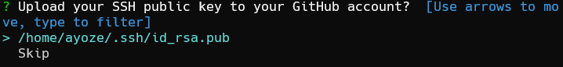

Ahora podemos autenticarnos con el token de Github que generamos anteriormente.

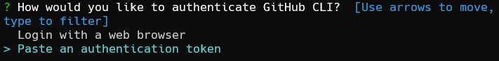

Una vez autenticados nos saldrá algo similar a lo siguiente:

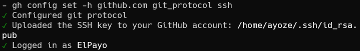

Para crear un repositorio basico podemos hacer lo siguiente:

Creamos una carpeta prueba, nos movemos dentro de ella e inicializamos un repositorio de git

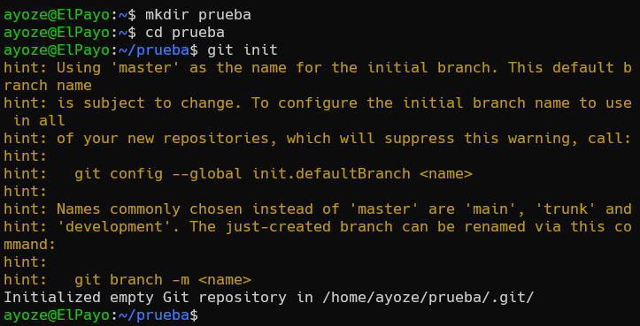

Ejecutamos el comando **```gh repo create```** y elegimos la segunda opción, subir un repositorio local existente

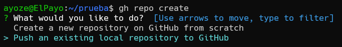

Ahora nos pide, en orden: 
+ La ruta al repositorio
+ El nombre
+ Una descripción 
+ La visibilidad

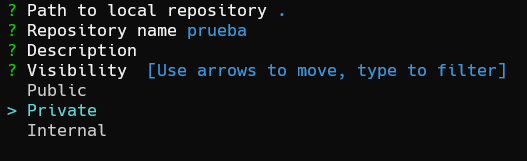

Añadimos un remoto del repositorio y especificamos como deberia llamarse el remoto, por defecto origin

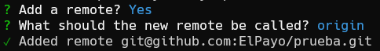

Como no podemos subir un repositorio vacio, creamos un README.md con un titulo y una frase descriptiva.

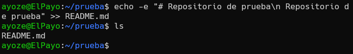

Hecho esto, añadimos los cambios con ***```git add .```*** , ***```git commit -m "mensaje"```*** y ***```git push```***.

Al ejecutar git push, va a dar un fallo, porque no hemos vinculado la rama del repositorio local con el repositorio remoto, por lo que ejecutamos ***```git push -u origin main```*** (-u es la versión corta del parámetro ***```--set-upstream```***), y como es la primera vez que hacemos algo en github desde esta máquina nos pregunta si queremos seguir conectandonos y recordar nuestra elección para un futuro

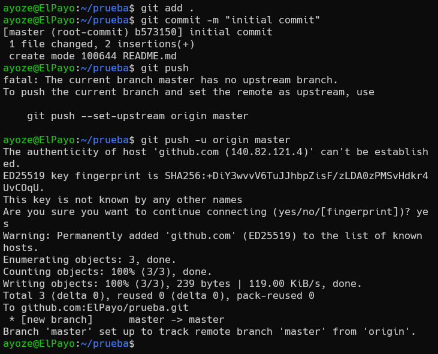

El repositorio queda de la siguiente manera:

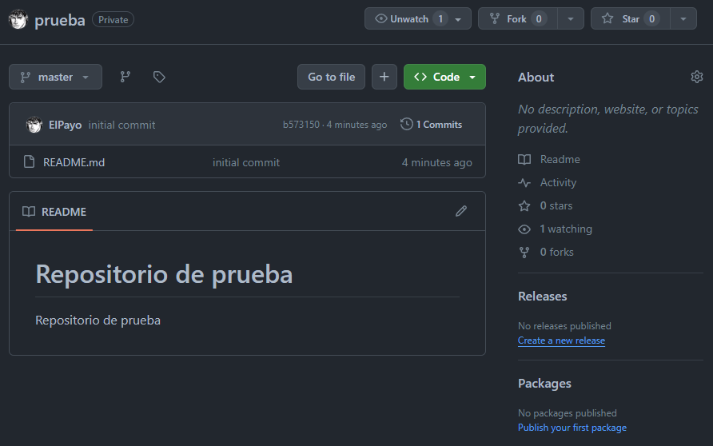

## Crear un script que automatice la creación del repo <a name="id1"></a>

Ahora vamos a crear un script que automatice la creación de repositorios, para ello vamos a necesitar un token de autenticación de github, si no sabes o no tienes uno, puedes generarlo [aquí](https://github.com/settings/tokens?type=beta).

Para que el token mencionado sirva para el uso que le queremos dar tenemos que seleccionar ***All repositories*** y darle los siguientes permisos:


Una vez que tenemos el token de autorización tenemos que guardarlo en un fichero de texto, recuerda su ruta

### Script de repo

Ahora procedemos a crear el script que llamaremos ***repo.sh***, una vez creado lo que tenemos que hacer es darle permisos de ejecución con el siguiente comando


```
sudo chmod u+x repo.sh
```

+ Contenido del script:

```
#!/bin/bash

take() {
        dir=$@
        mkdir -p $dir && cd $dir
}

if [ "$#" -eq 0 ]; then
        echo "Error: Se requiere al menos un argumento"
        exit 1
fi

actual_dir=$(pwd)

take "$actual_dir/$1"

echo "-----------------------------------------------------"
echo "Entrando en $1"
echo "-----------------------------------------------------"

git init

touch README.md

echo -e "# $1\n\nRepository of $1" | tee -a README.md > /dev/null

echo "-----------------------------------------------------"
echo "README.md añadido"
echo "-----------------------------------------------------"

gh auth login --with-token < <ruta-a-tu-token-de-github>.txt
gh repo create --private -s $actual_dir/$1 -r main --add-readme

echo "-----------------------------------------------------"
echo "Has sido autenticado y tu repo se ha creado"
echo "-----------------------------------------------------"

git add .
git commit -m "initial commit for this repo"
git push -u main master

echo "-----------------------------------------------------"
echo "Se han añadido los cambios locales a tu repositorio"
echo "-----------------------------------------------------"
```

> Recuerda usar la ruta de tu token.txt en el script en la línea de **gh auth login --with-token < \<ruta-a-tu-token-de-github\>.txt**

#### Modo de uso:

> Este script no es perfecto y no tiene todas las posibilidades del comando gh por lo que su uso se limita a 1 sola cosa con 1 solo modo de uso.


Una vez creado el script, usaremos el siguiente comando para hacer que sea accesible desde cualquier lugar del sistema:

```
sudo mv /usr/local/bin/repo
```

Modo de uso:

```
repo prueba2
```

El comando anterior lo que hace es, en caso de que no exista, crear una carpeta y se situa dentro de ella, luego inicializa un **repositorio de git** y lo convierte en un **repositorio privado** de nombre **prueba2** con una **rama principal master** en tu cuenta de Github.-e # $1

Repository of mano
-e # $1

Repository of mano
-e # $1

Repository of mano
-e # $1

Repository of mano
-e # $1

Repository of mano
-e # $1

Repository of mano
-e # $1

Repository of mano
-e # $1

Repository of mano
-e # $1

Repository of mano
-e # $1

Repository of mano
-e # $1

Repository of mano
-e # $1

Repository of mano
-e # $1

Repository of mano
-e # $1

Repository of mano3
-e # $1

Repository of mano4
-e # $1

Repository of mano3
-e # $1

Repository of mano4
